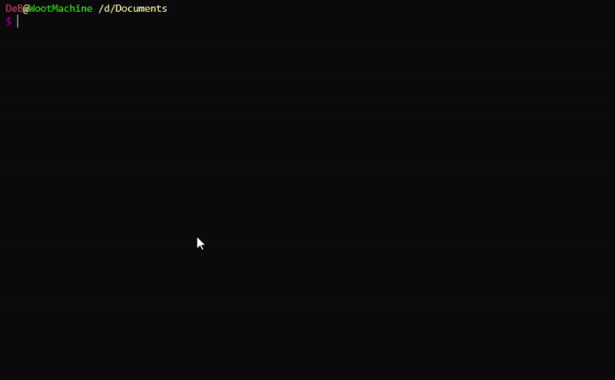
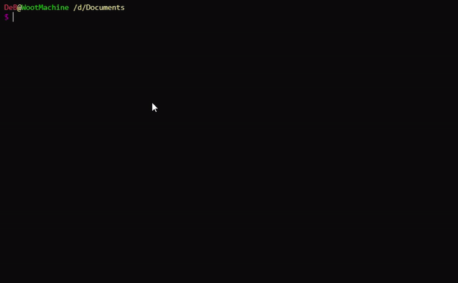

# ItsNotAscii.live
ItsNotAscii is a distributed terminal-based youtube player using Akka created for UCD's COMP30220 Distributed System Module.
Using cURL the client can connect to the system and view their favourite YouTube video.

It's as simple as typing in `curl localhost/<link>` to view your video!

